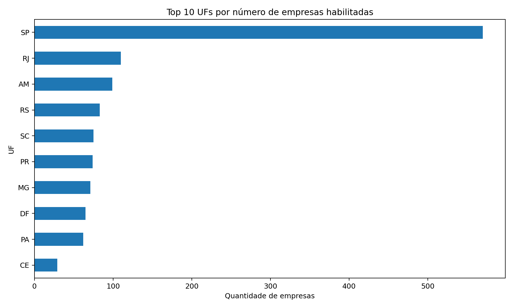
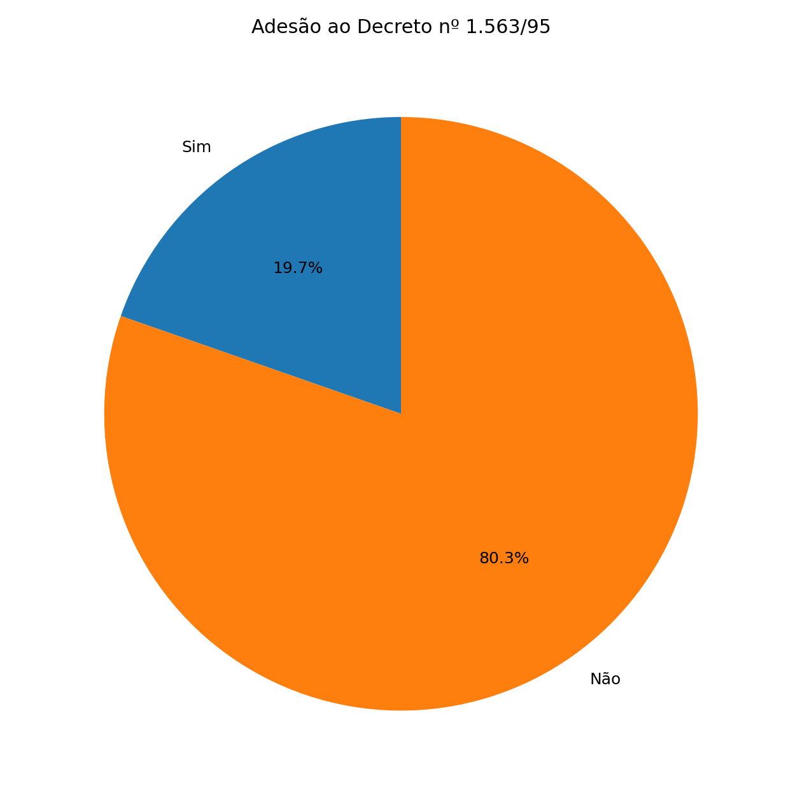

# Empresas com Habilitação Multimodal — ANTT

Análise exploratória do conjunto de dados **Operador Transporte Multimodal**, disponibilizado pela Agência Nacional de Transportes Terrestres (ANTT).

## Fonte dos dados

Dados Abertos da ANTT — Operador Transporte Multimodal:

https://dados.antt.gov.br/dataset/operador-transporte-multimodal/resource/9f76aca6-0e8d-4c13-8851-0ad8ced5c5b7

Arquivo analisado: `operador_transporte_multimodal (1).csv`

Total de registros analisados: **1,389**.

## Pergunta 1

**Quais são os estados com maior número de empresas habilitadas como Operador de Transporte Multimodal?**

### Resultado

O estado de **São Paulo (SP)** possui **570 empresas**, sendo a maior quantidade entre os registros que possuem UF preenchida.

A participação de SP entre os **1,384 registros com UF preenchida** é de aproximadamente **41.18%**.

### Fórmulas utilizadas no Excel

Para contar as empresas por UF:

```excel
=CONT.SE(DadosMultimodal[uf];A7)
```

Para identificar a maior quantidade:

```excel
=MÁXIMO(B7:B32)
```

Para identificar a UF correspondente:

```excel
=ÍNDICE(A7:A32;CORRESP(E9;B7:B32;0))
```

### Gráfico



---

## Pergunta 2

**Qual é a participação das empresas que aderiram ao Decreto nº 1.563/95?**

### Resultado

Das **1,389 empresas** analisadas:

- **273 (19.65%)** informam **Sim** para a adesão;
- **1116 (80.35%)** informam **Não**.

### Fórmulas utilizadas no Excel

Quantidade de empresas com adesão:

```excel
=CONT.SE(DadosMultimodal[adesao_ao_decreto_1563_95];A18)
```

Percentual:

```excel
=B18/SOMA($B$18:$B$19)
```

### Gráfico



---

## Estrutura do projeto

```text
.
├── README.md
├── operador_transporte_multimodal (1).csv
├── analise_empresas_multimodal.xlsx
├── empresas_por_uf.png
└── adesao_decreto.png
```

## Ferramentas

- Microsoft Excel
- Fórmulas de análise: `CONT.SE`, `MÁXIMO`, `ÍNDICE`, `CORRESP` e `SOMA`
- Gráficos de barras e pizza
- GitHub para versionamento e apresentação do projeto

## Observação

A Pergunta 1 considera somente os registros que possuem UF preenchida. O arquivo contém alguns registros sem UF informada, que não foram atribuídos artificialmente a nenhum estado.

